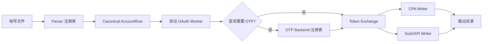

<p align="center">
  
</p>

<h1 align="center">GPT2JSON</h1>

<p align="center">
  协议优先的 Sub2API / CPA JSON 导出工具。面向中文环境，支持 CLI 与轻量桌面 GUI。
</p>

<p align="center">
  <a href="https://github.com/AyeSt0/gpt2json/blob/main/LICENSE"></a>
  
  
  
</p>

---

## 项目简介

GPT2JSON 是一个轻量独立工具，用于把账号输入文件通过协议优先的 OAuth 流程批量处理，并导出 Sub2API 与 CPA 可用的 JSON 文件。

设计目标：

- **协议优先**：默认不依赖浏览器自动化，速度更快，适合批处理。
- **自动并发**：多账号同时处理，运行过程有进度和脱敏日志。
- **格式可扩展**：输入格式、OTP 获取、JSON 导出互相解耦。
- **后端能力优先**：邮箱取码后续围绕 IMAP / Graph / JMAP / POP3 / API 做通用 backend，而不是在主流程里硬编码邮箱品牌。
- **不绑定本机环境**：仓库不包含用户账号、本地数据库、私有路径或导出结果。

## 功能状态

| 模块 | 状态 | 说明 |
| --- | --- | --- |
| 协议 OAuth 登录 | ✅ 已实现 | 直接走 HTTP/OAuth 流程，默认不启动浏览器。 |
| 并发批处理引擎 | ✅ 已实现 | 线程池并发，提供进度事件。 |
| Sub2API JSON 导出 | ✅ 已实现 | 输出总导入包和单账号文件。 |
| CPA JSON 导出 | ✅ 已实现 | 输出 token 文件和 manifest。 |
| 桌面 GUI | ✅ 已实现 | PySide6 单窗口小工具。 |
| 输入格式注册表 | ✅ 已实现 | 当前支持 dash 分隔格式，保留 auto-detect 扩展入口。 |
| 免登录 URL 取码 | ✅ 已实现 | 轮询 JSON/text 接口并提取验证码。 |
| 命令行取码 backend | ✅ 已实现 | 可调用外部命令获取验证码。 |
| IMAP / Graph / JMAP / POP3 / API | 🚧 规划中 | 已有 backend-first 注册表与接入口，具体 backend 待补。 |

## 桌面版

```bash
python -m pip install -e .[gui]
gpt2json-gui
```

GUI 流程：

1. 选择账号文件和输出目录；
2. 配置池名称、令牌类型、并发数和可选 OTP 参数；
3. 点击开始导出，得到 Sub2API + CPA JSON。

<p align="center">
  
</p>

## CLI 快速开始

```bash
python -m pip install -e .

gpt2json \
  --input samples/accounts.txt \
  --out-dir output \
  --concurrency 5 \
  --pool plus-20 \
  --token-type plus \
  --input-format auto \
  --otp-timeout 180 \
  --otp-interval 3
```

查看帮助：

```bash
gpt2json --help
gpt2json --version
```

## 当前输入格式

当前内置 parser 接收：

```text
GPT邮箱----GPT密码----OTP取码源
```

合成示例：

```text
user@example.test----example-gpt-password----https://otp-service.test/latest?mail={email}
```

字段语义必须分清：

| 字段 | 含义 |
| --- | --- |
| `GPT邮箱` | GPT/OpenAI 账号登录邮箱。 |
| `GPT密码` | GPT/OpenAI 登录密码，不是邮箱密码。 |
| `OTP取码源` | 免登录验证码 URL、取码邮箱或其它 parser 提供的取码源。 |

内部 canonical row 会把 GPT 凭据和邮箱凭据分开：

- `gpt_password` / 兼容字段 `password`：GPT/OpenAI 登录密码；
- `email_credential_kind`：邮箱侧凭据类型，如 `password`、`app_password`、`token`、`refresh_token`、`cookie`；
- `email_password`、`email_token`、`email_refresh_token`、`email_client_id`、`email_extra`：邮箱侧认证材料；
- `otp_source`：OTP 取码源。

详见：[输入格式扩展指南](docs/input-formats.md)。

## 输出结构

成功运行后输出：

```text
output/
├─ CPA/
│  └─ token_<account>_<timestamp>.json
├─ sub_accounts/
│  └─ sub_<account>_<timestamp>.json
├─ cpa_manifest.json
├─ progress.json
├─ results.safe.jsonl
├─ sub2api_plus_accounts.secret.json
└─ summary.json
```

`*.secret.json`、日志、本地数据库、输出目录默认被 `.gitignore` 忽略，避免误提交敏感内容。

## 架构



OTP 取码是 **backend-first**：provider/domain 只作为 backend 排序提示，主登录流程只调用 row-level 接口，不硬编码具体邮箱品牌。

| Backend | 状态 | 常见凭据 |
| --- | --- | --- |
| HTTP 免登录 URL | ✅ 已实现 | URL 内置 token / 查询参数 |
| 外部命令 | ✅ 已实现 | 由外部脚本自行管理 |
| IMAP | 🚧 规划中 | password、app_password |
| IMAP XOAUTH2 | 🚧 规划中 | access token、refresh token |
| Graph | 🚧 规划中 | token、refresh token、oauth2 |
| JMAP | 🚧 规划中 | token、app_password、api_key |
| POP3 | 🚧 规划中 | password、app_password |
| API | 🚧 规划中 | token、refresh_token、cookie、api_key |

详见：[邮箱 OTP backend 规划](docs/mail-backends.md)。

## 开发

```bash
git clone https://github.com/AyeSt0/gpt2json.git
cd gpt2json
python -m pip install -e .[gui,dev]
python -m pytest -q
```

常用命令：

```bash
gpt2json --help
python -m gpt2json.cli --help
python -m gpt2json.gui
```

## 仓库卫生

提交或发布前请确认：

- 不包含真实账号行；
- 不包含 token、cookie、密码、导出 JSON、数据库或日志；
- 不包含本机用户名、下载目录、绝对路径等个人信息；
- 文档和测试只使用合成示例。

仓库包含 issue template、PR template、`LICENSE`、`SECURITY.md`、`CONTRIBUTING.md`、`CHANGELOG.md`，以及 CI 模板 `docs/workflows/ci.yml`。

## 路线图

- 实现 IMAP app-password/password 取码 backend。
- 实现 IMAP XOAUTH2 token / refresh-token backend。
- 实现 Graph 取码 backend。
- 按需补 JMAP / POP3 / API backend。
- 增加更多常见账号文件格式 parser。
- 打包 Windows release。
- 增加导入/导出预设，但不在应用内保存用户敏感凭据。

## 许可证

MIT，详见 [LICENSE](LICENSE)。
