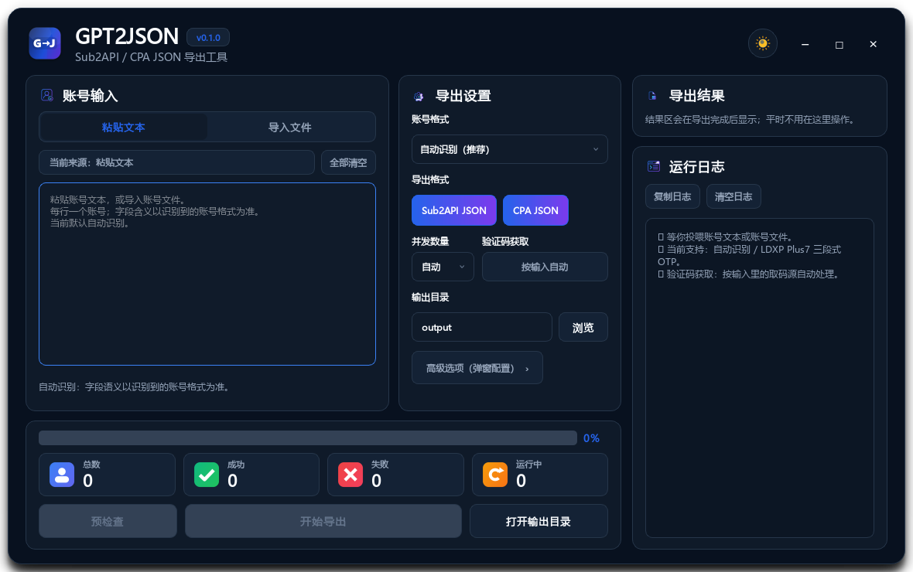

<p align="center">
  
</p>

<h1 align="center">GPT2JSON</h1>

<p align="center">
  轻量独立的 Sub2API / CPA JSON 导出工具。面向中文环境，支持 CLI 与桌面 GUI。
</p>

<p align="center">
  <a href="https://github.com/AyeSt0/gpt2json/blob/main/LICENSE"></a>
  
  
  
</p>

---

## 简介

GPT2JSON 是一个小型独立工具，用于把账号文本批量处理成 **Sub2API JSON** 和 / 或 **CPA 单账号 JSON**。

它只负责生成本地 JSON 文件，不会直接连接或写入 Sub2API 后台，适合先批量生成、检查后再手动导入。

## 输入格式

GPT2JSON 的输入解析是注册表驱动的，桌面版和 CLI 都保留了 `自动识别` / `--input-format` 入口，后续可以继续增加其它来源的账号格式。桌面版下拉栏会展示部分预制格式；未实现的格式会置灰展示，暂时不可选择。

当前版本内置并优先适配 **LDXP Plus7** 的账号格式：

> 账号来源：<https://pay.ldxp.cn/shop/plus7>

内置 parser 接收三段式文本：

```text
GPT邮箱----GPT密码----OTP取码源
```

示例：

```text
user@example.test----example-gpt-password----https://otp-service.test/latest?mail={email}
```

字段说明：

| 字段 | 含义 |
| --- | --- |
| `GPT邮箱` | GPT/OpenAI 账号登录邮箱。 |
| `GPT密码` | GPT/OpenAI 登录密码，不是邮箱密码。 |
| `OTP取码源` | 免登录验证码 URL、取码邮箱或其它取码源。 |

其它来源 / 其它邮箱凭据格式后续会作为新的 input format 接入；当前暂时请先选择 `自动识别`，或整理成上面的三段格式。

## 主要功能

- **文件或粘贴输入**：桌面版支持导入账号文件，也支持直接粘贴多行账号。
- **协议优先**：默认走 HTTP/OAuth 流程，不依赖浏览器自动化。
- **自动并发**：并发数默认 `自动`，也可以手动指定。
- **验证码处理**：支持免登录 URL 取码；可自动识别 JSON / 文本接口，以及前端 HTML 里暴露的取码 API。
- **导出可选**：可单独导出 `Sub2API JSON` 或 `CPA JSON`，也可以两个都导出。
- **脱敏日志**：运行过程展示进度和状态，尽量避免在日志中暴露敏感信息。

## 协议后端规划

GPT2JSON 会尽量向协议层收敛，而不是绑定某一家邮箱服务商名称。当前已接入：

| 后端 | 状态 | 用途 |
| --- | --- | --- |
| OAuth/HTTP 登录 | 已实现 | 协议方式获取本地可导入的 JSON。 |
| HTTP no-login URL | 已实现 | 免登录取码链接，支持 JSON、文本、HTML 内 API 自动发现。 |
| External command | 已实现 | 通过本地命令扩展自定义取码。 |

后续预留并逐步实现：

| 后端 | 典型用途 |
| --- | --- |
| IMAP / IMAP XOAUTH2 | 邮箱账密、应用密码、OAuth Token 取码。 |
| Graph | Graph 兼容邮箱 Token 取码。 |
| JMAP | Fastmail、LuckMail 或其它 JMAP/API 型邮箱。 |
| POP3 | 简单邮箱协议兜底。 |
| Provider API | AtomicMail、LuckMail 等自定义 API 型来源。 |

## 桌面版

```bash
python -m pip install -e .[gui]
gpt2json-gui
```

使用流程：

1. 选择账号格式：默认 `自动识别`；
2. 粘贴账号文本，或导入账号文件；
3. 选择输出目录；
4. 勾选导出格式：`Sub2API JSON`、`CPA JSON`；
5. 并发保持 `自动` 即可，必要时再手动调整；
6. 点击 `开始导出`。

<p align="center">
  
</p>

<p align="center">
  
</p>

## CLI 快速开始

```bash
python -m pip install -e .

gpt2json \
  --input accounts.txt \
  --out-dir output \
  --concurrency 0 \
  --input-format auto
```

从标准输入读取：

```bash
cat accounts.txt | gpt2json --stdin --out-dir output --no-cpa
```

查看帮助：

```bash
gpt2json --help
gpt2json --version
```

版本号统一来自 `gpt2json.__version__`；CLI、GUI 标题栏和 Python 包元数据会保持一致。

## 更新策略

GPT2JSON 不做真正的热更新，也不会在后台自动替换本地程序。桌面版左上角版本号可点击，会通过 GitHub Release 检查是否有新版本；发现更新后只打开下载页，由用户自行下载替换。

推荐发布方式：

- 平时开发：直接运行源码版；
- 对外分发：打 `vX.Y.Z` Git tag，由 GitHub Actions 构建并上传 Release 资产；
- 用户更新：下载 Release 里的 `GPT2JSON-windows-x64.zip`，解压覆盖旧目录。

## 输出文件

成功运行后，输出目录大致如下：

```text
output/
├─ CPA/
│  └─ <account-email>.json
├─ sub_accounts/
│  └─ sub_<account>_<timestamp>.json
├─ cpa_manifest.json
├─ progress.json
├─ results.safe.jsonl
├─ sub2api_accounts.secret.json
└─ summary.json
```

常用文件：

| 文件 | 说明 |
| --- | --- |
| `sub2api_accounts.secret.json` | Sub2API 导入用总包，结构对齐 codex-console 的“导出 Sub2API 格式”。 |
| `CPA/<account-email>.json` | CPA 单账号 token 文件；一个账号一个 JSON，结构对齐 codex-console 的“导出 CPA 格式”。 |
| `cpa_manifest.json` | CPA 文件索引，仅记录文件列表和脱敏元数据。 |
| `summary.json` | 本次导出的统计结果。 |

## 安装开发版

```bash
git clone https://github.com/AyeSt0/gpt2json.git
cd gpt2json
python -m pip install -e .[gui]
```

## 发版前自检

```bash
python -m pip install -e .[dev,gui]
python -m pytest -q
python -m build
python -m twine check dist/*
```

发版时先更新 `gpt2json/__init__.py` 与 `CHANGELOG.md`，再创建对应的 `vX.Y.Z` Git tag。

```bash
git tag v0.1.0
git push origin v0.1.0
```

如果只是发布 GitHub Release，建议使用 Git tag / GitHub 自动生成的 Source archive，不要手动打包本地工作区，避免把 `output/` 下的本地导出文件带进去。

## 许可证

MIT，详见 [LICENSE](LICENSE)。
