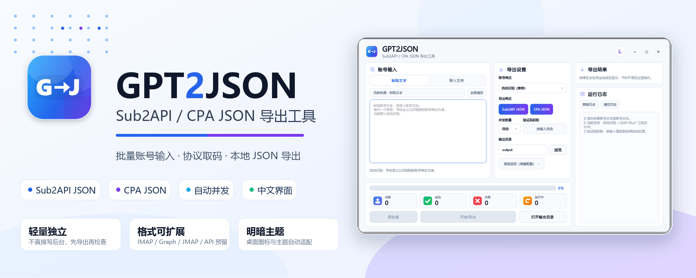
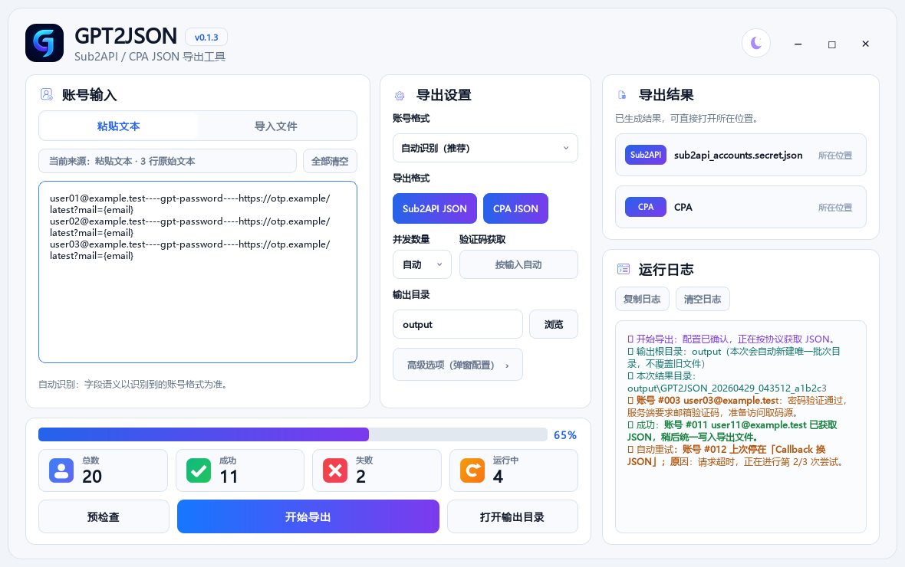
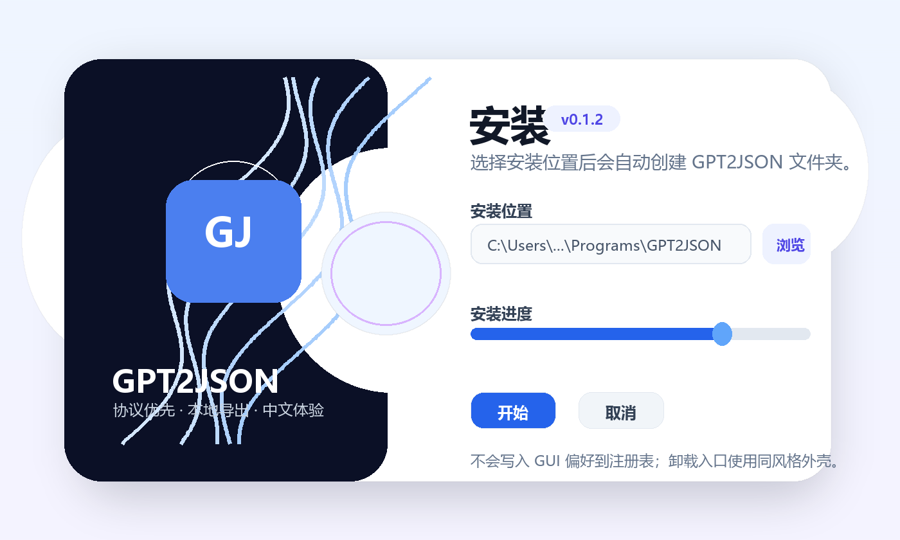

<p align="center">
  
</p>

<h1 align="center">GPT2JSON</h1>

<p align="center">
  面向中文交付场景的 <b>Sub2API / CPA JSON 导出工具</b>：协议优先、本地生成、批次隔离，不直接写入后台。
</p>

<p align="center">
  <a href="https://github.com/AyeSt0/gpt2json/releases/latest"></a>
  <a href="https://github.com/AyeSt0/gpt2json/releases/latest"></a>
  <a href="https://github.com/AyeSt0/gpt2json/actions/workflows/ci.yml"></a>
  <a href="LICENSE"></a>
</p>

<p align="center">
  <a href="#-为什么用-gpt2json">为什么用</a> ·
  <a href="#-界面预览">界面预览</a> ·
  <a href="#-快速开始">快速开始</a> ·
  <a href="#-当前支持的输入">输入格式</a> ·
  <a href="#-输出结果">输出结果</a> ·
  <a href="#-windows-发行包">Windows 发行包</a> ·
  <a href="#-开发">开发</a>
</p>

---

## ✦ 为什么用 GPT2JSON

很多账号交付流程里，真正需要的不是“把账号直接塞进某个后台”，而是先把可导入的 JSON 文件稳定生成出来，再由你检查、归档、导入。GPT2JSON 做的就是这一步：把账号文本转换为 **Sub2API JSON** 和 / 或 **CPA 单账号 JSON**。

| 设计点 | 用户收益 |
| --- | --- |
| **协议优先** | 默认走 HTTP/OAuth 流程，避免浏览器自动化带来的慢、重、不稳定。 |
| **本地生成** | 不直连你的 Sub2API 后台；导出文件保存在本机，导入动作由你控制。 |
| **批次隔离** | 每次运行创建唯一结果目录，历史文件不被覆盖，方便回溯。 |
| **中文 GUI** | 粘贴、导入、导出、日志、失败报告都按中文使用习惯组织。 |
| **可扩展输入** | 当前先适配 LDXP Plus7 三段式；后续 parser / OTP backend 可持续增加。 |


## ✦ 当前能力

| 模块 | 状态 | 说明 |
| --- | --- | --- |
| 账号输入 | ✅ 已实现 | 支持粘贴多行，也支持导入 `.txt` 文件。 |
| 自动识别 | ✅ 已实现 | 默认 `自动识别（推荐）`；未实现格式在界面中置灰展示。 |
| 登录流程 | ✅ 已实现 | 账密优先；只有服务端要求时才进入验证码阶段。 |
| 免登录取码 URL | ✅ 已实现 | 支持 JSON / 文本 / HTML 中自动提取验证码或发现接口。 |
| 并发与重试 | ✅ 已实现 | 默认自动并发；可恢复失败会自动重试，并追加自动重跑补救。 |
| Sub2API 导出 | ✅ 已实现 | 生成 `sub2api_accounts.secret.json`。 |
| CPA 导出 | ✅ 已实现 | 每个账号一个 JSON，统一放在 `CPA/` 文件夹，并生成 manifest。 |
| 取码协议扩展 | 🧭 规划中 | IMAP / Graph / JMAP / POP3 / Provider API。 |

> GPT2JSON 只负责生成 JSON 文件，不会直接写入你的 Sub2API 管理后台。这样更安全，也更适合批量交付前检查。

## ✦ 界面预览

<p align="center">
  <picture>
    <source media="(prefers-color-scheme: dark)" srcset="docs/assets/gui-zh-preview-dark.png">
    
  </picture>
</p>

界面重点放在四件事：**账号输入、导出格式、输出目录、过程日志**。日志会带账号序号和阶段提示，让用户知道当前卡在登录、取码、回调、写文件还是自动重试。

## ✦ 快速开始

### 方式 A：下载 Windows 发行包（推荐）

1. 打开 [GitHub Releases](https://github.com/AyeSt0/gpt2json/releases/latest)。
2. 普通用户下载 `GPT2JSON-Setup-vX.Y.Z.exe`。
3. 免安装用户下载 `GPT2JSON-vX.Y.Z-windows-x64.zip`。
4. 启动后粘贴账号文本，选择 `Sub2API JSON`、`CPA JSON` 或二者同时导出。

### 方式 B：从源码运行

```bash
git clone https://github.com/AyeSt0/gpt2json.git
cd gpt2json
python -m pip install -e .[gui]
gpt2json-gui
```

CLI 也可直接批处理：

```bash
gpt2json --input accounts.txt --out-dir output --concurrency 0 --input-format auto
```

从标准输入读取：

```bash
cat accounts.txt | gpt2json --stdin --out-dir output --no-cpa
```

## ✦ 当前支持的输入

当前版本优先适配 **LDXP Plus7** 的三段式账号格式：

> 格式来源：[`pay.ldxp.cn/shop/plus7`](https://pay.ldxp.cn/shop/plus7)

```text
GPT邮箱----GPT密码----OTP取码源
```

示例（合成数据）：

```text
user@example.test----example-gpt-password----https://otp-service.test/latest?mail={email}
```

| 字段 | 含义 | 注意 |
| --- | --- | --- |
| `GPT邮箱` | GPT / OpenAI 登录邮箱 | 只作为 GPT 账号使用。 |
| `GPT密码` | GPT / OpenAI 登录密码 | 不是邮箱密码。 |
| `OTP取码源` | 免登录验证码 URL、取码邮箱或其它取码源 | 当前实现免登录 URL；其它类型会通过后续 backend 接入。 |

后续新增格式时会明确区分：`GPT 密码`、`邮箱密码`、`邮箱 app-password`、`access token`、`refresh token`、`API key` 等字段，避免不同凭据语义混在一起。详细扩展说明见 [`docs/input-formats.md`](docs/input-formats.md)。

## ✦ 输出结果

每次运行都会在你选择的输出根目录下创建唯一批次目录：

```text
output/
└─ GPT2JSON_20260429_043512_a1b2c3/
   ├─ CPA/
   │  ├─ user01@example.test.json
   │  └─ user02@example.test.json
   ├─ cpa_manifest.json
   ├─ failure_report.safe.json
   ├─ progress.json
   ├─ results.safe.jsonl
   ├─ sub2api_accounts.secret.json
   └─ summary.json
```

| 文件 | 用途 |
| --- | --- |
| `sub2api_accounts.secret.json` | Sub2API 导入用总包。 |
| `CPA/<account-email>.json` | CPA 单账号 token 文件；一个账号一个 JSON。 |
| `cpa_manifest.json` | CPA 文件夹索引，只记录文件列表和脱敏元数据。 |
| `failure_report.safe.json` | 失败诊断报告，不包含原始密码、token 或取码源明文。 |
| `summary.json` | 本次统计；包含输出根目录、结果目录和批次 ID。 |
| `results.safe.jsonl` | 脱敏过程记录，方便定位账号阶段。 |

## ✦ Windows 发行包

<p align="center">
  
</p>

| 产物 | 适合场景 | 说明 |
| --- | --- | --- |
| `GPT2JSON-Setup-vX.Y.Z.exe` | 普通用户 | 定制安装界面 + 标准安装核心；安装到所选目录下的 `GPT2JSON` 子目录。 |
| `GPT2JSON-vX.Y.Z-windows-x64.zip` | 便携 / 临时使用 | 解压后运行 `GPT2JSON.exe`，不需要安装。 |

运行偏好保存到 `%LOCALAPPDATA%\GPT2JSON\settings.ini`。GUI 本身不写入业务注册表；安装器只创建 Windows 标准卸载项和快捷方式。需要完全免安装时，使用 ZIP 便携包即可。

## ✦ 后续路线

GPT2JSON 的长期方向是 **backend-first**：优先沉到 IMAP / Graph / JMAP / POP3 / API 这类可复用协议层，而不是把能力写死在某个邮箱品牌名里。

- [x] 协议优先 OAuth → JSON 导出
- [x] 中文 GUI：粘贴 / 文件输入、深浅色主题、输出目录打开
- [x] 自动并发、自动重试、失败诊断报告
- [x] 唯一批次输出目录，避免覆盖历史导出
- [ ] IMAP / IMAP XOAUTH2 取码 backend
- [ ] Graph / JMAP / POP3 backend
- [ ] CSV / 表格列映射导入
- [ ] 失败账号单独重跑入口

更完整的 backend 规划见 [`docs/mail-backends.md`](docs/mail-backends.md)。

## ✦ 隐私与安全

- 不要把真实账号、密码、token、cookie、导出 JSON、邮箱内容提交到 GitHub。
- 日志、失败报告、manifest 默认只写脱敏信息。
- `*.secret.json`、`output/`、本地构建产物已经加入 `.gitignore`。
- 反馈问题请使用合成示例，或先完成脱敏。

更多见 [`SECURITY.md`](SECURITY.md) 与 [`docs/privacy.md`](docs/privacy.md)。

## ✦ 开发

```bash
python -m pip install -e .[dev,gui]
python -m ruff check gpt2json tests scripts
python -m pytest -q
```

重新生成 README 视觉素材：

```bash
python scripts/generate_docs_assets.py
```

发版检查：

```bash
python scripts/check_release.py
python -m build
python -m twine check dist/*
```

完整流程见 [`docs/release.md`](docs/release.md)，贡献说明见 [`CONTRIBUTING.md`](CONTRIBUTING.md)。

## ✦ 许可证

MIT，详见 [`LICENSE`](LICENSE)。
