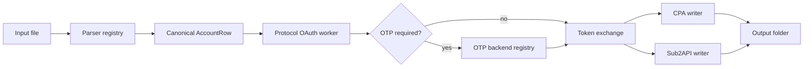

<p align="center">
  
</p>

<h1 align="center">GPT2JSON</h1>

<p align="center">
  Protocol-first desktop/CLI exporter for turning account input lines into clean <strong>Sub2API</strong> and <strong>CPA</strong> JSON files.
</p>

<p align="center">
  <a href="https://github.com/AyeSt0/gpt2json/blob/main/LICENSE"></a>
  
  
</p>

---

## Overview

GPT2JSON is a lightweight utility for batch-exporting account OAuth results into JSON formats consumed by Sub2API-compatible and CPA-style workflows. It favors a protocol-first flow over browser automation, supports concurrency, and keeps input parsing, OTP retrieval, and JSON export as separate extension points.

The project is intentionally generic:

- no bundled user accounts;
- no local database dependency;
- no private paths or machine-specific configuration;
- generated secrets and logs are ignored by default.

## Highlights

| Area | Status | Notes |
| --- | --- | --- |
| Protocol-first login flow | ✅ Implemented | Direct HTTP/OAuth flow, browser not required for the default path. |
| Concurrent batch engine | ✅ Implemented | Threaded worker pool with progress events. |
| Sub2API JSON export | ✅ Implemented | Writes one import bundle plus per-account files. |
| CPA JSON export | ✅ Implemented | Writes token files and a manifest. |
| Desktop GUI | ✅ Implemented | Compact Windows-style PySide6 app. |
| Input format registry | ✅ Implemented | Auto-detect entry point with current dash-delimited format. |
| No-login OTP URL | ✅ Implemented | Polls JSON/text endpoints and extracts verification codes. |
| Command OTP backend | ✅ Implemented | Optional external command hook. |
| Mailbox OTP backends | 🚧 Planned | Backend-first adapters for IMAP, Graph, JMAP, POP3, and provider APIs. |

## Desktop app

```bash
python -m pip install -e .[gui]
gpt2json-gui
```

The GUI is a single-window workflow:

1. select an account file and output folder;
2. configure pool/type/concurrency and optional OTP settings;
3. run export and collect Sub2API + CPA JSON outputs.

## CLI quick start

```bash
python -m pip install -e .

gpt2json \
  --input samples/accounts.txt \
  --out-dir output \
  --concurrency 5 \
  --pool plus-20 \
  --token-type plus \
  --input-format auto \
  --otp-timeout 180 \
  --otp-interval 3
```

### Current input format

The current built-in parser accepts:

```text
GPT_EMAIL----GPT_PASSWORD----OTP_SOURCE
```

Example with synthetic values:

```text
user@example.test----example-gpt-password----https://otp-service.test/latest?mail={email}
```

Important credential semantics:

| Field | Meaning |
| --- | --- |
| `GPT_EMAIL` | Login email for the GPT/OpenAI account. |
| `GPT_PASSWORD` | GPT/OpenAI login password. It is not the mailbox password. |
| `OTP_SOURCE` | No-login OTP URL, mailbox address, or other parser-provided OTP source. |

Internally, mailbox credentials are kept separate from GPT credentials:

- `gpt_password` / compatibility field `password` — GPT/OpenAI login password;
- `email_credential_kind` — mailbox credential type, for example `password`, `app_password`, `token`, `refresh_token`, `cookie`;
- `email_password`, `email_token`, `email_refresh_token`, `email_client_id`, `email_extra` — mailbox-side auth material;
- `otp_source` — OTP retrieval source.

See [docs/input-formats.md](docs/input-formats.md) for the parser extension model.

## Output layout

A successful run writes:

```text
output/
├─ CPA/
│  └─ token_<account>_<timestamp>.json
├─ sub_accounts/
│  └─ sub_<account>_<timestamp>.json
├─ cpa_manifest.json
├─ progress.json
├─ results.safe.jsonl
├─ sub2api_plus_accounts.secret.json
└─ summary.json
```

`*.secret.json`, logs, local databases, and output folders are ignored by `.gitignore`.

## Architecture



OTP is intentionally backend-first. Provider/domain detection is only used to choose the best backend plan; the main login flow calls row-level methods and does not hard-code mailbox providers.

| Backend | Status | Typical credential kinds |
| --- | --- | --- |
| HTTP no-login URL | ✅ Implemented | URL/token embedded in source |
| External command | ✅ Implemented | Managed outside GPT2JSON |
| IMAP | 🚧 Planned | password, app password |
| IMAP XOAUTH2 | 🚧 Planned | access token, refresh token |
| Graph | 🚧 Planned | OAuth token, refresh token |
| JMAP | 🚧 Planned | app password, token |
| POP3 | 🚧 Planned | password, app password |
| Provider API | 🚧 Planned | token, cookie, API key |

See [docs/mail-backends.md](docs/mail-backends.md) for backend planning.

## Development

```bash
git clone https://github.com/AyeSt0/gpt2json.git
cd gpt2json
python -m pip install -e .[gui,dev]
python -m pytest -q
```

Useful commands:

```bash
gpt2json --help
python -m gpt2json.cli --help
python -m gpt2json.gui
```

## Repository hygiene

Before publishing or attaching artifacts, verify:

- no real account lines;
- no tokens, cookies, passwords, exported JSON, databases, or logs;
- no local usernames or machine-specific paths;
- only synthetic examples are used in docs/tests.

The repository includes issue templates, a pull request template, `LICENSE`, `SECURITY.md`, `CONTRIBUTING.md`, `CHANGELOG.md`, and a CI workflow template in `docs/workflows/ci.yml`.

## Roadmap

- Add concrete IMAP and IMAP XOAUTH2 mailbox adapters.
- Add Graph-based OTP retrieval.
- Add JMAP/POP3/provider API adapters where useful.
- Add more input parsers for common account line formats.
- Package signed Windows release builds.
- Add import/export profile presets without storing user secrets in the app.

## License

MIT. See [LICENSE](LICENSE).

