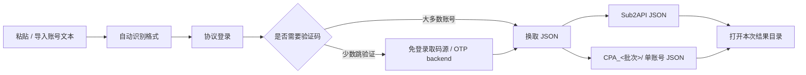

<p align="center">
  
</p>

<h1 align="center">GPT2JSON</h1>

<p align="center">
  面向中文交付场景的 <b>Sub2API / CPA JSON 导出工具</b>。协议优先、本地生成、批次隔离，不直接写入后台。
</p>

<p align="center">
  <a href="https://github.com/AyeSt0/gpt2json/releases/latest"></a>
  <a href="https://github.com/AyeSt0/gpt2json/releases/latest"></a>
  <a href="https://github.com/AyeSt0/gpt2json/releases/latest"></a>
  <a href="https://github.com/AyeSt0/gpt2json/actions/workflows/ci.yml"></a>
  <a href="LICENSE"></a>
</p>

<p align="center">
  <a href="#-为什么用-gpt2json">为什么用</a> ·
  <a href="#-v017-更新重点">更新重点</a> ·
  <a href="#-界面预览">界面预览</a> ·
  <a href="#-快速开始">快速开始</a> ·
  <a href="#-当前支持的输入">输入格式</a> ·
  <a href="#-输出结果">输出结果</a> ·
  <a href="#-开发与发版">开发</a>
</p>

---

## ✦ 为什么用 GPT2JSON

很多账号交付流程里，真正需要的不是“把账号直接塞进某个后台”，而是先把可导入的 JSON 文件稳定生成出来，再由你检查、归档、导入。GPT2JSON 做的就是这一步：把账号文本转换为 **Sub2API JSON** 和 / 或 **CPA 单账号 JSON**。

| 设计点 | 用户收益 |
| --- | --- |
| **协议优先** | 默认走 HTTP/OAuth 流程，尽量不依赖浏览器自动化，速度更快、资源占用更低。 |
| **本地生成** | 只在本机处理账号文本与导出文件；不直接写入你的 Sub2API 管理后台。 |
| **批次隔离** | 每次运行创建唯一结果目录，CPA 子目录也带唯一批次名，避免老文件被覆盖或误用。 |
| **客户端事客户端毕** | 可恢复失败会先走单账号自动重试与自动重跑补救；批次结束后还可触发批次级自动补跑，用户不用靠手工翻日志兜底。 |
| **中文桌面体验** | 粘贴、导入、导出、日志、失败报告都按中文使用习惯组织。 |
| **可扩展输入** | 当前先适配 LDXP Plus7 三段式；后续 parser / OTP backend 可持续接入。 |



## ✦ v0.1.7 更新重点

| 类型 | 变化 |
| --- | --- |
| 安装体验 | 安装器可识别本机已有 GPT2JSON，自动切换为升级 / 修复模式并沿用原安装目录。 |
| 账号级恢复 | 可恢复失败会先执行自动重试；仍未成功时进入单账号自动重跑补救。 |
| 批次级自动补跑 | 批次结束后若生成 `failed_rerun.secret.txt`，客户端默认自动读取 1 次，只把可恢复失败账号作为新批次补跑；高级选项可关闭或调到最多 3 次。 |
| 手动补跑入口 | GUI 仍保留“重跑失败账号”，批次级自动补跑后仍失败时可继续手动读取同一清单。 |
| 终态收敛 | 账号停用、锁定、不存在、凭据无效等服务端明确终态不写入重跑清单，避免无意义消耗。 |
| 文档与素材 | README、GUI 预览图、Hero 图和版本号同步到 v0.1.7。 |

## ✦ 当前能力

| 模块 | 状态 | 说明 |
| --- | --- | --- |
| 账号输入 | ✅ 已实现 | 支持粘贴多行，也支持导入 `.txt` 文件。 |
| 自动识别 | ✅ 已实现 | 默认 `自动识别（推荐）`；未实现格式在界面中置灰展示。 |
| 登录流程 | ✅ 已实现 | 账密优先；只有服务端要求时才进入验证码阶段。 |
| 免登录取码 URL | ✅ 已实现 | 支持从 JSON / 文本 / HTML 中提取验证码或发现接口。 |
| 并发与重试 | ✅ 已实现 | 默认自动并发；高级选项可调整并发、超时、自动重试和自动重跑补救。 |
| Sub2API 导出 | ✅ 已实现 | 生成 `sub2api_accounts.secret.json` 总包。 |
| CPA 导出 | ✅ 已实现 | 每个账号一个 JSON，统一放在唯一 `CPA_<批次>/` 文件夹，并生成 manifest。 |
| 导出校验 | ✅ 已实现 | 导出完成后校验 Sub2API / CPA JSON 结构，日志标记“可导入”或“不建议导入”。 |
| 输出追踪 | ✅ 已实现 | 默认输出到程序目录下的 `output/`；手动改过输出目录后会记住。`summary.json`、`results.safe.jsonl`、`failure_report.safe.json` 均为脱敏诊断信息。 |
| 失败清单 | ✅ 已实现 | 仍可恢复的失败账号会写入 `failed_rerun.secret.txt`；批次级自动补跑默认 1 次，GUI “重跑失败账号”可继续手动补跑同一清单。 |
| 取码源解析 | ✅ 持续增强 | 支持 JSON / 文本 / HTML API 取码；多验证码会优先选择最新验证码，并过滤登录前旧码。 |
| 邮箱协议 backend | 🧭 规划中 | IMAP / IMAP XOAUTH2 / Graph / JMAP / POP3 / Provider API。 |

> GPT2JSON 只负责生成 JSON 文件，不直接导入 Sub2API 后台。这样更安全，也更适合批量交付前检查。

## ✦ 界面预览

<p align="center">
  <picture>
    <source media="(prefers-color-scheme: dark)" srcset="docs/assets/gui-zh-preview-dark.png">
    
  </picture>
</p>

界面重点放在四件事：**账号输入、导出格式、输出目录、过程日志**。日志会带账号序号和阶段提示，让用户知道当前卡在登录、取码、回调、写文件还是自动重试。

## ✦ 快速开始

### 方式 A：下载 Windows 发行包（推荐）

1. 打开 [GitHub Releases](https://github.com/AyeSt0/gpt2json/releases/latest)。
2. 普通用户下载 `GPT2JSON-Setup-v0.1.7.exe`。
3. 免安装用户下载 `GPT2JSON-v0.1.7-windows-x64.zip`。
4. 启动后粘贴账号文本，选择 `Sub2API JSON`、`CPA JSON` 或二者同时导出。
5. 任务完成后点击“所在位置”，检查本次结果目录后再导入目标系统。

### 方式 B：从源码运行

```bash
git clone https://github.com/AyeSt0/gpt2json.git
cd gpt2json
python -m pip install -e .[gui]
gpt2json-gui
```

CLI 也可直接批处理：

```bash
gpt2json --input accounts.txt --out-dir output --concurrency 0 --input-format auto
```

从标准输入读取：

```bash
cat accounts.txt | gpt2json --stdin --out-dir output --no-cpa
```

## ✦ 当前支持的输入

当前版本优先适配 **LDXP Plus7** 的三段式账号格式：

> 格式来源：[`pay.ldxp.cn/shop/plus7`](https://pay.ldxp.cn/shop/plus7)

```text
GPT邮箱----GPT密码----OTP取码源
```

示例（合成数据）：

```text
user@example.test----example-gpt-password----https://otp-service.test/latest?mail={email}
```

| 字段 | 含义 | 注意 |
| --- | --- | --- |
| `GPT邮箱` | GPT / OpenAI 登录邮箱 | 只作为 GPT 账号使用。 |
| `GPT密码` | GPT / OpenAI 登录密码 | 不是邮箱密码。 |
| `OTP取码源` | 免登录验证码 URL、取码邮箱或其它取码源 | 当前实现免登录 URL；其它类型会通过后续 backend 接入。 |

后续新增格式时会明确区分：`GPT 密码`、`邮箱密码`、`邮箱 app-password`、`access token`、`refresh token`、`API key` 等字段，避免不同凭据语义混在一起。详细扩展说明见 [`docs/input-formats.md`](docs/input-formats.md)。

## ✦ 输出结果

桌面版默认会把结果放到程序所在目录下的 `output/`；如果你手动选择过其它输出目录，之后会记住该目录。每次运行都会在输出根目录下创建唯一批次目录：

```text
output/
└─ GPT2JSON_20260429_043512_a1b2c3/
   ├─ CPA_20260429_043512_a1b2c3/
   │  ├─ user01@example.test.json
   │  └─ user02@example.test.json
   ├─ cpa_manifest.json
   ├─ failed_rerun.secret.txt        # 可选：仍有可恢复失败时生成
   ├─ failure_report.safe.json
   ├─ progress.json
   ├─ results.safe.jsonl
   ├─ sub2api_accounts.secret.json
   └─ summary.json
```

| 文件 | 用途 |
| --- | --- |
| `sub2api_accounts.secret.json` | Sub2API 导入用总包。 |
| `CPA_<批次>/<account-email>.json` | CPA 单账号 token 文件；一个账号一个 JSON；目录名随批次唯一化，避免误覆盖。 |
| `cpa_manifest.json` | CPA 文件夹索引，只记录 CPA 目录名、文件列表和脱敏元数据。 |
| `failed_rerun.secret.txt` | 可恢复失败账号的原始行清单，仅在仍有可恢复失败时生成；包含敏感账号信息，供批次级自动补跑和 GUI “重跑失败账号”读取。 |
| `failure_report.safe.json` | 失败诊断报告，不包含原始密码、token 或取码源明文。 |
| `summary.json` | 本次统计；包含输出根目录、结果目录、批次 ID 和导出路径。 |
| `results.safe.jsonl` | 脱敏过程记录，方便定位每个账号的阶段和最终状态。 |

`summary.json` 中还会写入 `export_validation`：GUI 会把结果翻译成“导出校验：可导入 / 不建议导入”。如果出现“不建议导入”，请先查看 `summary.json` 中的问题列表，修正后重新导出。

## ✦ 自动重试与失败诊断

GPT2JSON 的目标是让客户端尽可能通过自动重试、自动重跑补救和批次级自动补跑处理可恢复问题：

### 术语说明

- **自动重试**：单账号常规 retry，用于同一次账号处理中的网络波动、验证码等待等短暂问题。
- **自动重跑补救**：单账号额外补救 attempt；只有自动重试仍未成功、且失败仍属于可恢复失败时才会进入。
- **批次级自动补跑**：批次结束后自动读取本批次 `failed_rerun.secret.txt`，只把可恢复失败账号作为新批次补跑；默认 1 次，高级选项可关闭或调到最多 3 次。
- **重跑失败账号**：GUI 手动入口，读取同一份 `failed_rerun.secret.txt`；批次级自动补跑结束后仍可保留给用户手动触发。
- **可恢复失败 / 终态失败**：前者适合继续补救，例如验证码旧码、OTP 超时、Callback 超时、HTTP 429/5xx；后者是账号停用、锁定、不存在、凭据无效等服务端明确结论。
- **导出校验 / 可导入 / 不建议导入**：导出完成后检查 Sub2API / CPA JSON 结构；通过时显示“可导入”，发现结构问题时显示“不建议导入”。

| 场景 | 处理方式 |
| --- | --- |
| 取码源慢、验证码旧码、OTP 超时 | 先走自动重试，再进入自动重跑补救。 |
| Callback / OAuth 换 JSON 超时 | 视为可恢复失败，按配置继续自动重试；仍未成功时进入自动重跑补救，批次结束后可由批次级自动补跑接手。 |
| HTTP 429 / 5xx / 临时网络错误 | 先自动重试；必要时进入自动重跑补救，批次结束后还可由批次级自动补跑接手，避免用户手动重跑整批。 |
| 账号停用、锁定、不存在、凭据无效 | 归类为终态失败，不写入 `failed_rerun.secret.txt`，也不消耗批次级自动补跑次数。 |
| 仍失败的账号 | 终态失败只写入 `failure_report.safe.json`；可恢复失败额外写入 `failed_rerun.secret.txt`，供批次级自动补跑和 GUI “重跑失败账号”读取。 |

批次级自动补跑不会重新处理整批账号，只读取 `failed_rerun.secret.txt` 中的可恢复失败账号并创建新批次；默认 1 次，高级选项可关闭或调到最多 3 次。若批次级自动补跑后仍有可恢复失败，用户仍可通过 GUI “重跑失败账号”手动入口继续补跑同一份失败清单。

取码源如果一次返回多个验证码，GPT2JSON 会优先按 `created_at` / `received_at` / `timestamp` 等时间字段选择最新验证码；没有时间字段时优先选择更靠后的验证码，避免误提交历史旧码。

## ✦ Windows 发行包

<p align="center">
  
</p>

| 产物 | 适合场景 | 说明 |
| --- | --- | --- |
| `GPT2JSON-Setup-v0.1.7.exe` | 普通用户 | 定制安装界面 + 标准安装核心；安装到所选目录下的 `GPT2JSON` 子目录。 |
| `GPT2JSON-v0.1.7-windows-x64.zip` | 便携 / 临时使用 | 解压后运行 `GPT2JSON.exe`，不需要安装。 |

安装器会读取 Windows 标准卸载项：如果检测到本机已安装 GPT2JSON，会默认使用原安装目录，并切换为升级 / 修复模式。

运行偏好保存到 `%LOCALAPPDATA%\GPT2JSON\settings.ini`。GUI 本身不写入业务注册表；安装器只创建 Windows 标准卸载项和快捷方式。需要完全免安装时，使用 ZIP 便携包即可。

## ✦ 路线图

GPT2JSON 的长期方向是 **backend-first**：优先沉到 IMAP / Graph / JMAP / POP3 / API 这类可复用协议层，而不是把能力写死在某个邮箱品牌名里。

- [x] 协议优先 OAuth → JSON 导出
- [x] 中文 GUI：粘贴 / 文件输入、深浅色主题、输出目录打开
- [x] 自动并发、自动重试、自动重跑补救、批次级自动补跑、失败诊断报告
- [x] 唯一批次输出目录与唯一 CPA 子目录，避免覆盖历史导出
- [x] 可恢复失败账号手动补跑入口（GUI “重跑失败账号”）
- [ ] IMAP / IMAP XOAUTH2 取码 backend
- [ ] Graph / JMAP / POP3 backend
- [ ] CSV / 表格列映射导入

更完整的 backend 规划见 [`docs/mail-backends.md`](docs/mail-backends.md)。

## ✦ 隐私与安全

- 不要把真实账号、密码、token、cookie、导出 JSON、邮箱内容提交到 GitHub。
- 日志、失败报告、manifest 默认只写脱敏信息。
- `*.secret.json`、`*.secret.txt`、`output/`、本地构建产物已经加入 `.gitignore`。
- 反馈问题请使用合成示例，或先完成脱敏。

更多见 [`SECURITY.md`](SECURITY.md) 与 [`docs/privacy.md`](docs/privacy.md)。

## ✦ 文档索引

| 文档 | 内容 |
| --- | --- |
| [`docs/input-formats.md`](docs/input-formats.md) | 输入 parser 设计、字段语义和后续格式扩展约定。 |
| [`docs/mail-backends.md`](docs/mail-backends.md) | IMAP / Graph / JMAP / POP3 / API 取码 backend 规划。 |
| [`docs/troubleshooting.md`](docs/troubleshooting.md) | 常见失败、验证码超时、输出目录和注册表说明。 |
| [`docs/privacy.md`](docs/privacy.md) | 本地保存、输出文件、日志脱敏和 GitHub 反馈注意事项。 |
| [`docs/release.md`](docs/release.md) | 本地检查、Windows 打包、GitHub Release 流程。 |

## ✦ 开发与发版

```bash
python -m pip install -e .[dev,gui,release]
python -m ruff check gpt2json tests scripts
python -m pytest -q
```

重新生成 README 视觉素材：

```bash
python scripts/generate_docs_assets.py
```

发版检查：

```bash
python scripts/check_release.py
```

完整流程见 [`docs/release.md`](docs/release.md)，贡献说明见 [`CONTRIBUTING.md`](CONTRIBUTING.md)。

## ✦ 许可证

MIT，详见 [`LICENSE`](LICENSE)。
